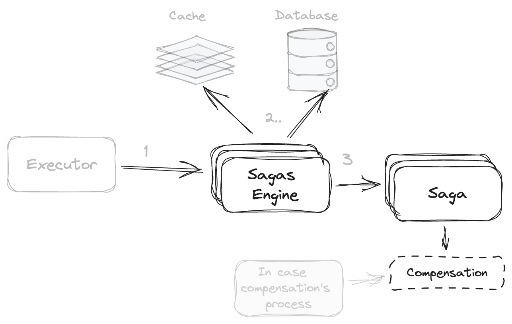
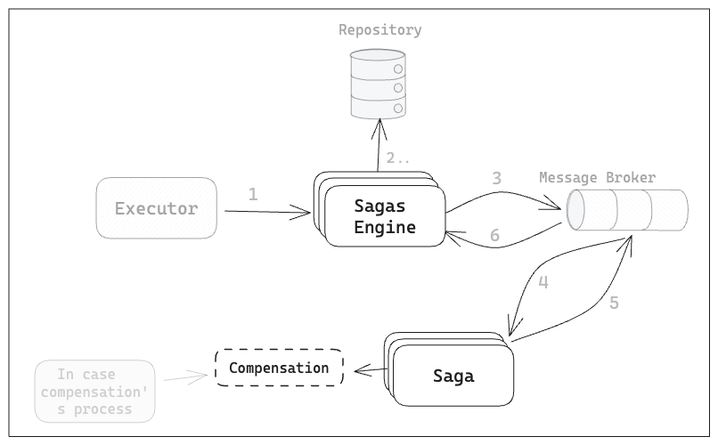
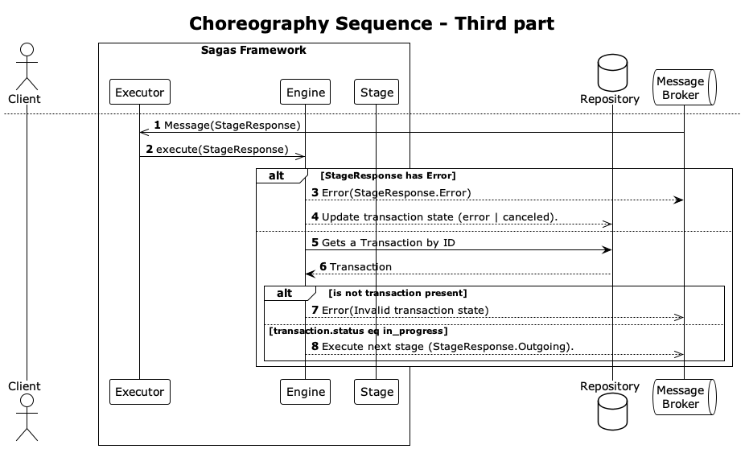

= SAGA Framework

SAGA (Software Automation, Generation, and Administration) is a known pattern to manage long-live transactions in distributed environments.
Long Live Transactions (LLT), is a transaction that takes significant time to be completed and requires synchronization between multiple transactions.

When working in a distributed system, in most cases it is necessary to maintain a transactionality during the execution of a defined process, maintaining the properties of an ACID transaction (Atomicity, Consistency, Isolation and Durability), to ensure that the processed and generated data are valid, however, the Saga pattern does not have the property of isolation, which can generate interference between different processes or transactions; A solution to this problem was solved by https://www.proquest.com/scholarly-journals/enhancing-saga-pattern-distributed-transactions/docview/2679673542/se-2["Daraghmi, E. et al. (2022)"]
with the proposed quota cache mechanism and commit-sync service.

This project aims to define a way to implement this microservices pattern by specifying a structure that solves surrounding problems during the implementation and integration of a distributed system using this pattern.
The problems that are solved in this project are: definition of a domain for the creation of a flow, definition of the implementation and integration interfaces, and in addition to the main behaviour of the pattern, its compensation, two new mechanisms are integrated, preprocessing and post-processing that solve the integration problem when contracts or communication interfaces are unknown, thus allowing to extend it to any type of implementation.

The implementation is currently developed in Java, and is expected to be extended to other programming languages in the future.

== Prerequisites

* Java 21
* Maven &gt;=3.8.x

== Installation

[source,shell]
----
mvn clean install
----

== Implementation Examples

=== Spring Boot

* link:./samples/basic-sample[Basic Sample]
* link:./samples/coffee-shop[Coffee Shop]

== Documentation

For the Saga pattern implementation, there are 2 options, orchestration or choreography, with the orchestration all the execution works in the same machine that received the request, but with choreography, the execution of one transaction is distributed between all deployed engines.

image:./docs/assets/usecases.png[usecases]

=== Orchestration

The _Executor_ of the *_Sagas Engine_* should be any system that exposes some interfaces that serve as triggers.

The *_Sagas Engine_* to start an execution will receive a Flow ID, Metadata, and a Payload, with the ID, can obtain a Flow, which determines the activities and evaluations to be sequentially executed.

Every compensation of an Activity will be added to a stack data structure to be executed in LIFO order.

image:./docs/assets/sequence-orchestration.png[sequence-orchestration]

=== Choreography

In the choreography scenario, the flow execution is distributed using a message broker; once the Sagas Engine obtains the Flow, it will publish the first Step with additional information into the queue, and another instance of the Sagas Engine will be in charge of executing it and putting the next consecutive step in the queue.

____
This implementation uses the Saga Engine as a coordinator, to re-use the different Stages in multiple Flows.
____

image:./docs/assets/sequence-choreography-1.png[sequence-orchestration]
image:./docs/assets/sequence-choreography-2.png[sequence-orchestration]

=== Domain

[#flow]
==== Flow

The flow is the sagas' definition, every flow is unique and contains all the stages required to execute it.

|===
|Attribute |Type |Required |Description

|id |string |true |A unique identifier for the flow.
|name |string |false |A human-readable name for the flow.
|initial_stage |string |true |The initial stage of the flow.
|stages |object |true |Dictionary or map of <<stage,Stage>>.
|metadata |object |false |Dictionary or map with additional data.
|configuration |object |false |<<flow_configuration,FlowConfiguration>>

|===

[#flow_configuration]
===== Flow Configuration

The flow configuration contains the flow timeout and the all-or-nothing flag required to handle the flow behaviour.

|===
|Attribute |Type |Required |Description

|timeout |string |false `(by default 1 minute)` |A timeout of the flow.
|all_or_nothing |boolean |false `(by default false)` |All or nothing (true, false). This is in case some of the stages fail, the process will continue if `all_or_nothing` is false, otherwise, will be stopped.
|===

[#stage]
==== Stage

The stage is the main unit of work in the flow, every stage is unique and contains all the information required to execute it.

|===
|Attribute |Type |Required |Description

|id |string |true |A unique identifier for the Stage.
|name |string |false |A human-readable name for the Stage.
|type |string |true |Specifies the type of the stage that can be `activity`, `evaluation`.
|metadata |object |false |Dictionary or map with additional data.
|configuration |object |false |<<stage_configuration,StageConfiguration>>
|===

[#stage_configuration]
===== Stage Configuration

The stage configuration contains the implementation and parameters required to execute the stage.

|===
|Attribute |Type |Required |Description

|implementation |string |false `(by default 'default')` |The implementation type of the stage.
|parameters |object |false |Dictionary or map with additional information to the stage.
|===

[#activity]
==== Activity

The activity contains all the tasks that should be executed and manages other features like looping and resilience.

|===
|Attribute |Type |Required |Description

|activity_tasks |array |true |The list of <<activity_task,ActivityTask>> that will be executed.
|parallel |boolean |false |Indicates if all tasks should be executed in parallel or sequentially.
|outgoing |string |false |The next stage identifier to be executed.
|allOrNothing |boolean |false |The next stage identifier to be executed.
|===

[#activity_task]
===== ActivityTask

The activity task contains the information necessary to pre-process the input request of a task, then execute it and finally post-process its response, while recording its compensation.

|===
|Attribute |Type |Required |Description

|task |string |true |The task identifier.
|pre_processor |object |false |It represents a task processor that will be executed before the main task in the activity. <<task_processor,TaskProcessor>>
|post_processor |object |false |It represents a task processor that will be executed after the main task in the activity. <<task_processor,TaskProcessor>>
|compensation |object |false |It represents a compensation task that will be executed if the main task or post-processing task fails. <<task_processor,TaskProcessor>>
|metadata |object |false |Dictionary or map with additional data for the task.
|===

[#task_processor]
==== TaskProcessor

The task processor encapsulates the identifier of a task and its additional parameters to be executed from an activity.

|===
|Attribute |Type |Required |Description

|task |string |true |The task identifier to be processed.
|metadata |object |false |Dictionary or map with additional data for the task.
|===

[#evaluation]
==== Evaluation

The Evaluation is a specialized type of Stage that contains logic to determine the next stage to execute based on certain conditions.
It includes an EvaluationTask that encapsulates the task for evaluating the conditions, a list of Condition objects that define the conditions to be evaluated, and a defaultOutgoing string that specifies the ID of the default stage to transition to if none of the conditions are met.

|===
|Attribute |Type |Required |Description

|evaluation_task |object |true |<<evaluationTask,EvaluationTask>> for evaluating the conditions.
|conditions |array |true |List of <<condition,Condition>> to be evaluated.
|default |string |true |Default Stage name to be executed in case of any condition match.
|===

[#evaluationTask]
==== EvaluationTask

Data that is shared between the engine and the services.

|===
|Attribute |Type |Required |Description

|task |string |true |The task identifier to execute the evaluations.
|pre_processor |object |false |It represents a task processor that will be executed before the main task in the evaluation. <<task_processor,TaskProcessor>>
|metadata |object |false |Dictionary or map with additional data.
|===

[#condition]
===== Condition

The Condition is evaluated during the execution of an EvaluationTask; it contains an expression that defines the outgoing string that specifies the ID of the stage to transition to if the condition is met.

|===
|Attribute |Type |Required |Description

|expression |string |true |A boolean expression that depends on the script engine.
|outgoing |string |true |The ID of the stage to transition to if the condition is met.
|===

=== Task

This is used to define and manage the details of a specific task in a workflow.

|===
|Attribute |Type |Required |Description

|id |string |true |The task identifier.
|name |string |false |A human-readable name for the task.
|implementation |string |true |The implementation type of the task.
|compensation |object |false |<<task_processor,TaskProcessor>>
|metadata |object |false |Dictionary or map with additional data.
|configuration |object |false |<<task_configuration,TaskConfiguration>>
|===

[#task_configuration]
==== TaskConfiguration

Defines and manage the configuration and behaviour of a task.

|===
|Attribute |Type |Required |Description

|executor |string |true |The executor that will execute the task.
|resilience |object |false |<<resilience_configuration,ResilienceConfiguration>>
|parameters |object |false |Dictionary or map with additional information to the task configuration.
|===

[#resilience_configuration]
===== ResilienceConfiguration

Represents the configuration for resilience in a task. It includes timeout, retry and circuit breaker configurations.

|===
|Attribute |Type |Required |Description

|timeout |string |false `(by default 1 minute)` |The timeout of the task.
|retry |object |false |<<retry_configuration,RetryConfiguration>>
|circuit_breaker |object |false |<<circuit_breaker_configuration,CircuitBreakerConfiguration>>
|===

[#retry_configuration]
====== RetryConfiguration

TODO

|===
|Attribute |Type |Required |Description

|===

[#circuit_breaker_configuration]
====== CircuitBreakerConfiguration

TODO

|===
|Attribute |Type |Required |Description

|===

=== Flow States

==== Transaction

The Transaction encapsulates the status of a flow, including its unique identifiers, data, and timestamps.

|===
|Attribute |Type |Description

|transaction_id |string |The transaction identifier (unique).
|flow_id |string |The flow identifier (unique).
|correlation_id |string |The correlation identifier (unique).
|data |object |The state data of the transaction.
|status |string |Transaction state type (in_progress, canceled, completed, error)
|started_at |timestamp |Date time when the transaction is created.
|updated_at |timestamp |Date time when the transaction is updated.
|expires_at |timestamp |Date time when the transaction expires.
|===

==== Checkpoint

Represents a checkpoint in a workflow transaction.

A Checkpoint is created every time a stage is executed in a workflow.
It encapsulates the status of the execution, including the transaction and flow identifiers, correlation identifier, metadata, request and response data, and timestamps.
It also includes the outgoing stage identifier and the incoming stage.

Each execution of a stage will generate multiple checkpoints with different statuses, allowing for tracking and auditing of the workflow.

|===
|Attribute |Type |Description

|transaction_id |string |The transaction identifier (unique).
|flow_id |string |The flow identifier (unique).
|correlation_id |string |The correlation identifier (unique) of the flow.
|incoming |object |The incoming serialized <<stage,Stage>>.
|outgoing |string |The outgoing stage identifier.
|metadata |object |The metadata of the incoming stage.
|request |object |The request of the incoming stage.
|response |object |The response of the incoming stage.
|status |string |The checkpoint  <<status,Status>> (in_progress, canceled, completed, error) of the incoming stage.
|started_at |timestamp |Date time when the checkpoint is created.
|updated_at |timestamp |Date time when the checkpoint is updated.
|expires_at |timestamp |Date time when the checkpoint expires.

|===

[#status]
==== Status

General status used during the execution of a flow.

|===
|Attribute |Description

|IN_PROGRESS |Indicate that is executing.
|CANCELED |Indicate that was canceled.
|COMPLETED |Indicate that was completed.
|ERROR |Indicate that was an error.

|===

[#compensation]
==== Compensation

Represents a compensation event message in a workflow transaction.

A Compensation is generated every time an activity task is executed, and it contains a compensation task processor.
It encapsulates the transaction identifier, task name, metadata, request and response data, and the timestamp when it was created.

This is sent via an event for further processing.

|===
|Attribute |Type |Description

|transaction_id |string |The transaction identifier (unique).
|task |string |The task identifier.
|metadata |object |The metadata of the task.
|request |object |The request of the task.
|response |object |The response of the task.
|created_at |timestamp |Date time when the compensation is created.

|===
