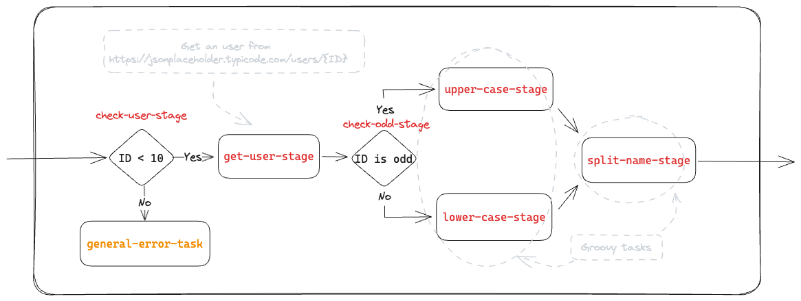

# Basic Example

This example shows how to configure the sagas engine using the default configuration, and runs the below workflow.



## Requirements

- Java 21
- Maven >=3.8.x

## Installation

```shell
mvn clean package
```

## Execution

Start the server that contains the test.

```shell
mvn spring-boot:run
```

Then call the service that starts and executes the workflow.

### Async Execution

```shell
curl --location 'http://localhost:8080/api/v1/async' \
--header 'Content-Type: application/json' \
--data '{
  "flowId": "basic-sample-flow",
  "correlationId": "3a27e108-d1d6-4ba6-8b20-c56da9a4808a",
  "metadata": null,
  "payload": {
    "user": {
      "id": 9
    }
  }
}'
```

### Sync Execution

```shell
curl --location 'http://localhost:8080/api/v1/sync' \
--header 'Content-Type: application/json' \
--data '{
  "flowId": "basic-sample-flow-sync",
  "correlationId": "3a27e108-d1d6-4ba6-8b20-c56da9a4808a",
  "metadata": null,
  "payload": {
    "user": {
      "id": 9
    }
  }
}'
```

### Compensation

```shell
curl --location 'http://localhost:8080/api/v1/sync' \
--header 'Content-Type: application/json' \
--data '{
  "flowId": "basic-sample-flow-compensation",
  "correlationId": "680bc800-1233-4eff-a6ed-aa51e4cb550c",
  "metadata": {
    "language": "es-ES"
  },
  "payload": {
    "user": {
      "id": 7
    }
  }
}'
```

### Resilience Testing

The `resilience-flow` demonstrates the circuit breaker and retry patterns for fault tolerance. This flow tests how the
system handles failures and recovers gracefully.

#### Flow Description

The resilience flow (`flow-resilience.json`) contains:

- **Flow ID**: `resilience-flow`
- **Purpose**: Tests retry and circuit breaker resilience patterns
- **Task**: `http-status` with comprehensive resilience configuration
- **Timeout**: 5 minutes with all-or-nothing execution

#### Resilience Configuration

The `http-status` task includes both retry and circuit breaker patterns:

**Retry Configuration:**

- **Max Attempts**: 2 retries
- **Wait Duration**: 1 second between attempts
- **Retry on Workflow Exceptions**: Yes
- **Success Policy**: `status-ok-policy` (validates HTTP 200 status)

**Circuit Breaker Configuration:**

- **Failure Threshold**: 2 failures to open circuit
- **Wait Duration in Open State**: 1 minute before transitioning to half-open
- **Success Threshold**: 1 success to close circuit from half-open
- **Success Policy**: `status-ok-policy` (validates HTTP 200 status)
- **Fallback Task**: `general-resilience-response` (returns service unavailable message)

#### Test Scenarios

**1. Success Scenario (HTTP 200)**

```shell
curl --location 'http://localhost:8080/api/v1/sync' \
--header 'Content-Type: application/json' \
--data '{
  "flowId": "resilience-flow",
  "correlationId": "resilience-success-test",
  "metadata": null,
  "payload": {
    "status": "200"
  }
}'
```

**2. Failure Scenario (HTTP 500 - triggers retry)**

```shell
curl --location 'http://localhost:8080/api/v1/sync' \
--header 'Content-Type: application/json' \
--data '{
  "flowId": "resilience-flow",
  "correlationId": "resilience-retry-test",
  "metadata": null,
  "payload": {
    "status": "500"
  }
}'
```

**3. Circuit Breaker Scenario (HTTP 404 - opens circuit after threshold)**

```shell
# First call - failure 1
curl --location 'http://localhost:8080/api/v1/sync' \
--header 'Content-Type: application/json' \
--data '{
  "flowId": "resilience-flow",
  "correlationId": "resilience-cb-test-1",
  "metadata": null,
  "payload": {
    "status": "404"
  }
}'

# Second call - failure 2 (opens circuit)
curl --location 'http://localhost:8080/api/v1/sync' \
--header 'Content-Type: application/json' \
--data '{
  "flowId": "resilience-flow",
  "correlationId": "resilience-cb-test-2",
  "metadata": null,
  "payload": {
    "status": "404"
  }
}'

# Third call - circuit open (returns fallback response)
curl --location 'http://localhost:8080/api/v1/sync' \
--header 'Content-Type: application/json' \
--data '{
  "flowId": "resilience-flow",
  "correlationId": "resilience-cb-test-3",
  "metadata": null,
  "payload": {
    "status": "200"
  }
}'
```

#### Expected Behaviors

- **Retry Pattern**: On transient failures (5xx errors), the system retries up to 2 times with 1-second intervals
- **Circuit Breaker**: After 2 consecutive failures, the circuit opens and subsequent calls execute the fallback task
- **Fallback Response**: When circuit is open, returns `{"message": "Service unavailable"}` instead of failing
- **Recovery**: After 1 minute, the circuit transitions to half-open, allowing test calls to potentially close the
  circuit

#### Monitoring Resilience

Check the application logs to observe:

- Retry attempts with delay intervals
- Circuit breaker state transitions (CLOSED → OPEN → HALF_OPEN → CLOSED)
- Fallback task execution when circuit is open
- Success policy validation results
