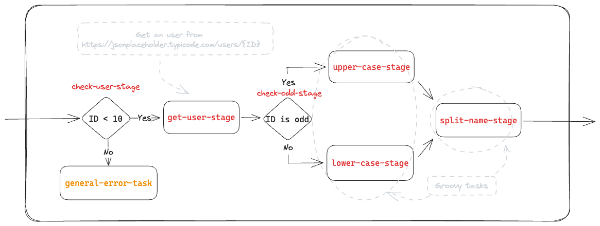

# Basic Example

This example shows how to configure the sagas engine using the default configuration, and runs the below workflow.



## Requirements

- Java 21
- Maven >=3.8.x

## Installation

```shell
mvn clean package
```

## Execution

Start the server that contains the test.

```shell
mvn spring-boot:run
```

Then call the service that starts and executes the workflow.

### Async Execution

```shell
curl --location 'http://localhost:8080/api/name/async/customizer' \
--header 'Content-Type: application/json' \
--data '{
  "flowId": "basic-sample-flow",
  "correlationId": "3a27e108-d1d6-4ba6-8b20-c56da9a4808a",
  "metadata": null,
  "payload": {
    "user": {
      "id": 9
    }
  }
}'
```

### Sync Execution

```shell
curl --location 'http://localhost:8080/api/name/sync/customizer' \
--header 'Content-Type: application/json' \
--data '{
  "flowId": "basic-sample-flow-sync",
  "correlationId": "3a27e108-d1d6-4ba6-8b20-c56da9a4808a",
  "metadata": null,
  "payload": {
    "user": {
      "id": 9
    }
  }
}'
```
