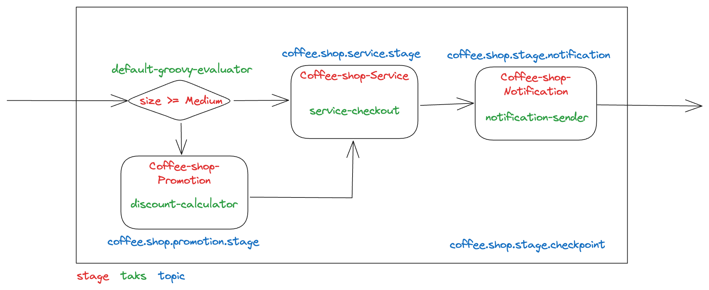

# Coffee-Shop  

This test demonstrates the use of the framework to distribute the different stages of a flow on different servers. In this specific case, Kafka was used as a mechanism for interaction between the saga coordinator and the stages.



* Coordinator [coffee-shop-api](coffee-shop-api)
* Stages
  * [coffee-shop-promotion](coffee-shop-promotion)
    * discount-calculator
  * [coffee-shop-service](coffee-shop-service)
    * service-checkout
  * [coffee-shop-notification](coffee-shop-notification)
    * notification-sender

## Installation

Install and run the Kafka (Redpanda) server locally with docker. 

```shell
docker-compose up -d
```

Redpanda Console: http://localhost:8080

Install the project.

```shell
mvn clean install -Dmaven.test.skip=true
```

## Execution

From the root project:

* Start the coordinator server

  ```shell
  cd coffee-shop-api
  mvn spring-boot:run
  ```

* Start the promotion server

  ```shell
  cd coffee-shop-promotion
  mvn spring-boot:run
  ```

* Start the service server

  ```shell
  cd coffee-shop-service
  mvn spring-boot:run
  ```

* Start the notification server

  ```shell
  cd coffee-shop-notification
  mvn spring-boot:run
  ```
  
## Testing

Possible sizes: "small", "medium", "large"

```shell
curl --location 'http://localhost:7070/api/v1/coffees/orders' \
--header 'Content-Type: application/json' \
--data '{
  "flowId": "coffee-shop-order",
  "correlationId": "206f34bd-fa71-4078-adaf-7dd1c115b9c0",
  "metadata": {
    "notification": true
  },
  "payload": {
    "size": "large"
  }
}'
```

### Logs

```shell
Executing workflow 'Coffee Shop Orders Flow' with correlation ID '206f34bd-fa71-4078-adaf-7dd1c115b9c0'
Received checkpoint for 'coffee-shop-order' with correlation ID '206f34bd-fa71-4078-adaf-7dd1c115b9c0' in stage 'Check cup size' and status 'IN_PROGRESS'
Executing evaluation stage 'Check cup size'
Handling checkpoint in progress: co.orquex.sagas.sample.cs.api.event.CheckpointEventMessage@620f448b
Received checkpoint for 'coffee-shop-order' with correlation ID '206f34bd-fa71-4078-adaf-7dd1c115b9c0' in stage 'Check cup size' and status 'COMPLETED'
Handling checkpoint completed: Checkpoint[status=COMPLETED, transactionId=6d30774c-70e7-465f-a55a-975b80300176, flowId=coffee-shop-order, correlationId=206f34bd-fa71-4078-adaf-7dd1c115b9c0, metadata={notification=true}, request={size=large}, response={size=large}, outgoing=coffee-shop-promotion, incoming=co.orquex.sagas.domain.stage.Evaluation@2fe9a36f, createdAt=null, updatedAt=null]
Executing next stage 'Coffee shop promotion stage'
Stage 'Coffee shop promotion stage' sent to topic 'coffee.shop.stage.promotion'
Checkpoint received Checkpoint[status=COMPLETED, transactionId=6d30774c-70e7-465f-a55a-975b80300176, flowId=coffee-shop-order, correlationId=206f34bd-fa71-4078-adaf-7dd1c115b9c0, metadata={notification=true}, request={size=large}, response={discount=50, size=large}, outgoing=coffee-shop-service, incoming=co.orquex.sagas.domain.stage.Activity@4556e48e, createdAt=null, updatedAt=null]
Received checkpoint for 'coffee-shop-order' with correlation ID '206f34bd-fa71-4078-adaf-7dd1c115b9c0' in stage 'Coffee shop promotion stage' and status 'COMPLETED'
Handling checkpoint completed: Checkpoint[status=COMPLETED, transactionId=6d30774c-70e7-465f-a55a-975b80300176, flowId=coffee-shop-order, correlationId=206f34bd-fa71-4078-adaf-7dd1c115b9c0, metadata={notification=true}, request={size=large}, response={discount=50, size=large}, outgoing=coffee-shop-service, incoming=co.orquex.sagas.domain.stage.Activity@4556e48e, createdAt=null, updatedAt=null]
Executing next stage 'Coffee shop service stage'
Checkpoint received Checkpoint[status=IN_PROGRESS, transactionId=6d30774c-70e7-465f-a55a-975b80300176, flowId=coffee-shop-order, correlationId=206f34bd-fa71-4078-adaf-7dd1c115b9c0, metadata={notification=true}, request={size=large}, response=null, outgoing=null, incoming=co.orquex.sagas.domain.stage.Activity@59ddd288, createdAt=null, updatedAt=null]
Received checkpoint for 'coffee-shop-order' with correlation ID '206f34bd-fa71-4078-adaf-7dd1c115b9c0' in stage 'Coffee shop promotion stage' and status 'IN_PROGRESS'
Handling checkpoint in progress: co.orquex.sagas.sample.cs.api.event.CheckpointEventMessage@6048389d
Stage 'Coffee shop service stage' sent to topic 'coffee.shop.stage.service'
Checkpoint received Checkpoint[status=COMPLETED, transactionId=6d30774c-70e7-465f-a55a-975b80300176, flowId=coffee-shop-order, correlationId=206f34bd-fa71-4078-adaf-7dd1c115b9c0, metadata={notification=true}, request={discount=50, size=large}, response={order={size=large, price=10.0, discount=50, total=5.0}}, outgoing=coffee-shop-notification, incoming=co.orquex.sagas.domain.stage.Activity@31d61a0, createdAt=null, updatedAt=null]
Received checkpoint for 'coffee-shop-order' with correlation ID '206f34bd-fa71-4078-adaf-7dd1c115b9c0' in stage 'Coffee shop service stage' and status 'COMPLETED'
Handling checkpoint completed: Checkpoint[status=COMPLETED, transactionId=6d30774c-70e7-465f-a55a-975b80300176, flowId=coffee-shop-order, correlationId=206f34bd-fa71-4078-adaf-7dd1c115b9c0, metadata={notification=true}, request={discount=50, size=large}, response={order={size=large, price=10.0, discount=50, total=5.0}}, outgoing=coffee-shop-notification, incoming=co.orquex.sagas.domain.stage.Activity@31d61a0, createdAt=null, updatedAt=null]
Executing next stage 'Coffee shop notification stage'
Checkpoint received Checkpoint[status=IN_PROGRESS, transactionId=6d30774c-70e7-465f-a55a-975b80300176, flowId=coffee-shop-order, correlationId=206f34bd-fa71-4078-adaf-7dd1c115b9c0, metadata={notification=true}, request={discount=50, size=large}, response=null, outgoing=null, incoming=co.orquex.sagas.domain.stage.Activity@495b4135, createdAt=null, updatedAt=null]
Received checkpoint for 'coffee-shop-order' with correlation ID '206f34bd-fa71-4078-adaf-7dd1c115b9c0' in stage 'Coffee shop service stage' and status 'IN_PROGRESS'
Handling checkpoint in progress: co.orquex.sagas.sample.cs.api.event.CheckpointEventMessage@1fcea75d
Stage 'Coffee shop notification stage' sent to topic 'coffee.shop.stage.notification'
Checkpoint received Checkpoint[status=IN_PROGRESS, transactionId=6d30774c-70e7-465f-a55a-975b80300176, flowId=coffee-shop-order, correlationId=206f34bd-fa71-4078-adaf-7dd1c115b9c0, metadata={notification=true}, request={order={size=large, price=10.0, discount=50, total=5.0}}, response=null, outgoing=null, incoming=co.orquex.sagas.domain.stage.Activity@43c4ac31, createdAt=null, updatedAt=null]
Received checkpoint for 'coffee-shop-order' with correlation ID '206f34bd-fa71-4078-adaf-7dd1c115b9c0' in stage 'Coffee shop notification stage' and status 'IN_PROGRESS'
Checkpoint received Checkpoint[status=COMPLETED, transactionId=6d30774c-70e7-465f-a55a-975b80300176, flowId=coffee-shop-order, correlationId=206f34bd-fa71-4078-adaf-7dd1c115b9c0, metadata={notification=true}, request={order={size=large, price=10.0, discount=50, total=5.0}}, response={order={size=large, price=10.0, discount=50, total=5.0}}, outgoing=null, incoming=co.orquex.sagas.domain.stage.Activity@5f7f2d9a, createdAt=null, updatedAt=null]
Received checkpoint for 'coffee-shop-order' with correlation ID '206f34bd-fa71-4078-adaf-7dd1c115b9c0' in stage 'Coffee shop notification stage' and status 'COMPLETED'
Handling checkpoint in progress: co.orquex.sagas.sample.cs.api.event.CheckpointEventMessage@c1c3cf3
Handling checkpoint completed: Checkpoint[status=COMPLETED, transactionId=6d30774c-70e7-465f-a55a-975b80300176, flowId=coffee-shop-order, correlationId=206f34bd-fa71-4078-adaf-7dd1c115b9c0, metadata={notification=true}, request={order={size=large, price=10.0, discount=50, total=5.0}}, response={order={size=large, price=10.0, discount=50, total=5.0}}, outgoing=null, incoming=co.orquex.sagas.domain.stage.Activity@5f7f2d9a, createdAt=null, updatedAt=null]
Workflow finished with response {"order":{"size":"large","price":10.0,"discount":50,"total":5.0}}
```